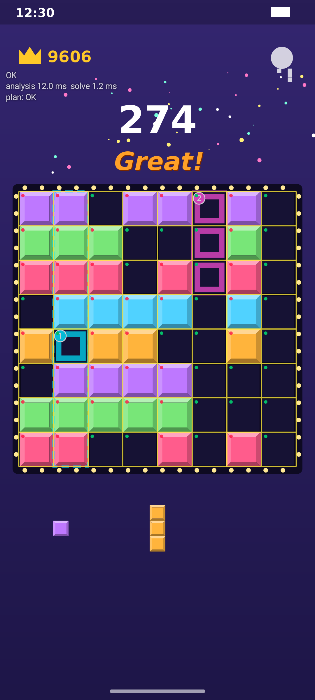

# GridHelper

8×8 블록 퍼즐 게임 화면을 실시간으로 캡처·인식해서, 남은 블록 3개의 **최적 배치 순서와 위치**를 게임 화면 위
오버레이로 보여주는 개인용 Android 어시스턴트입니다.

- **표시만 합니다.** 자동 터치·자동 플레이 기능이 없습니다 (접근성 서비스·입력 주입 없음).
- **네트워크를 쓰지 않습니다.** `INTERNET` 권한이 없고 분석 SDK도 없습니다. 모든 처리는 기기 안에서 합니다.
- 외부 비전 라이브러리(OpenCV 등) 없이 픽셀 샘플링만 사용합니다.



*합성 테스트 화면에 실제 오버레이 렌더러(`GuideRenderer`)를 디버그 모드로 합성한 이미지입니다.
①② = 놓는 순서, 점선 = 그 수에서 지워질 줄, 칸 모서리의 점 = 칸 판정(디버그).*

---

## 목차
1. [빠른 시작](#1-빠른-시작)
2. [Windows에서 빌드하기](#2-windows에서-빌드하기)
3. [APK 사이드로드 설치](#3-apk-사이드로드-설치)
4. [권한 설정 순서 (첫 실행)](#4-권한-설정-순서-첫-실행)
5. [사용법](#5-사용법)
6. [프로젝트 구조](#6-프로젝트-구조)
7. [동작 원리](#7-동작-원리)
8. [테스트와 픽스처](#8-테스트와-픽스처)
9. [성능](#9-성능)
10. [검증 현황과 알려진 한계](#10-검증-현황과-알려진-한계)

---

## 1. 빠른 시작

```bat
git clone <this repo>
cd <repo>
gradlew.bat assembleDebug
adb install -r app\build\outputs\apk\debug\app-debug.apk
```

앱 실행 → **시작** → 권한 3단계 허용 → 게임 실행.

| 항목 | 값 |
|---|---|
| minSdk / compileSdk / targetSdk | 29 / 36 / 36 (Android 10 ~ 16) |
| Android Gradle Plugin / Gradle | 8.13.2 / 8.14.3 (wrapper 포함) |
| Kotlin / Coroutines | 2.2.21 / 1.10.2 |
| Compose UI / Material3 / activity-compose | 1.10.0 / 1.4.0 / 1.10.1 |
| JDK | 17 이상 (Android Studio 내장 JBR 21 권장) |

## 2. Windows에서 빌드하기

### 2-1. Android Studio로 (권장)
1. [Android Studio](https://developer.android.com/studio) 최신 버전을 설치합니다. JDK는 Studio에 들어 있는 JBR을 씁니다.
2. **File ▸ Open** 으로 이 폴더(`settings.gradle.kts`가 있는 곳)를 엽니다.
3. Gradle Sync가 끝날 때까지 기다립니다. *Android SDK Platform 36 이 없다*는 메시지가 나오면
   **Tools ▸ SDK Manager ▸ SDK Platforms** 에서 **Android 16 (API 36)** 을 체크해 설치합니다.
4. **Build ▸ Build App Bundle(s) / APK(s) ▸ Build APK(s)**
   → `app\build\outputs\apk\debug\app-debug.apk`
5. 폰을 USB로 연결했다면 ▶ **Run 'app'** 으로 바로 설치·실행할 수도 있습니다.

> Studio가 AGP 업그레이드를 제안하면 받아도 됩니다 (Upgrade Assistant). 더 최신 플랫폼(API 37 등)을 쓰려면
> SDK Manager에서 설치한 뒤 `gradle.properties` 의 `gridhelper.compileSdk` / `gridhelper.targetSdk` 값만 올리세요.

### 2-2. 명령 프롬프트로
```bat
:: Studio 내장 JDK 사용
set JAVA_HOME=C:\Program Files\Android\Android Studio\jbr
:: SDK 위치 (Studio를 한 번 실행했다면 local.properties가 자동 생성되어 생략 가능)
echo sdk.dir=C\:\\Users\\%USERNAME%\\AppData\\Local\\Android\\Sdk> local.properties

gradlew.bat assembleDebug            :: 디버그 APK
gradlew.bat assembleRelease          :: R8 최적화 릴리스 APK (개인용: 로컬 디버그 키로 서명)
gradlew.bat :solver:test :vision:test :app:testDebugUnitTest   :: 단위 테스트 전체
```
릴리스 APK: `app\build\outputs\apk\release\app-release.apk` (Monte Carlo 등 성능이 중요하면 릴리스 빌드 권장).

## 3. APK 사이드로드 설치

**방법 A — adb (USB)**
1. 폰: **설정 ▸ 휴대전화 정보 ▸ 빌드 번호** 7번 탭 → 개발자 옵션 → **USB 디버깅** 켜기
2. PC: `%LOCALAPPDATA%\Android\Sdk\platform-tools\adb.exe install -r app-debug.apk`

**방법 B — 파일 복사**
1. APK를 폰의 `Download` 폴더로 복사 (USB, 클라우드 등)
2. 파일 관리자에서 APK 탭 → *출처를 알 수 없는 앱* 설치 허용 → 설치
3. Play 프로텍트 경고가 뜨면 **세부정보 ▸ 무시하고 설치**

> 파일 관리자로 설치한 경우 일부 기기에서 권한 화면에 "제한된 설정" 안내가 뜰 수 있습니다.
> 그때는 **설정 ▸ 애플리케이션 ▸ GridHelper ▸ ⋮ ▸ 제한된 설정 허용** 후 다시 시도하세요.

## 4. 권한 설정 순서 (첫 실행)

앱의 **시작** 버튼이 아래 순서를 차례로 안내합니다.

| 순서 | 권한 | 내용 |
|---|---|---|
| ① | **다른 앱 위에 표시** (`SYSTEM_ALERT_WINDOW`) | 설정 화면이 열리면 GridHelper를 허용하고 뒤로 돌아옵니다. |
| ② | **알림** (Android 13+) | 상시 알림의 [일시정지]/[종료] 버튼용. 거부해도 동작은 합니다. |
| ③ | **화면 캡처 동의** (MediaProjection) | **매 실행마다** 묻습니다 (Android 14+ 정책). Android 14+에서는 전체 화면 공유만 선택되도록 요청합니다. Android 13 이하에서 선택지가 나오면 **전체 화면**을 고르세요. |

동의하면 포그라운드 서비스(`foregroundServiceType="mediaProjection"`)가 시작되고 상단에 상시 알림이 표시됩니다.

## 5. 사용법

1. GridHelper에서 **시작** → 권한 허용 → 게임으로 이동합니다.
2. 보드가 보이면 추천이 표시됩니다. 보드가 인식되지 않는 화면(메뉴, 다른 앱)에서는 오버레이가 자동으로 숨겨집니다.
3. 블록을 하나 놓을 때마다 보드 변화를 감지해 **남은 블록 기준으로 즉시 다시 계산**합니다.

**화면 읽는 법**
- 칸 안쪽의 굵은 테두리 = 고스트 블록. 색과 원형 번호로 순서를 구분합니다: **① 하늘색 → ② 분홍 → ③ 주황**
- 점선 사각형 = 그 단계에서 지워질 행/열 (같은 색)
- 상단 빨간 배너 = **GAME OVER 경고**: 남은 블록을 모두 놓는 순서가 없을 때, 점수가 가장 높은 1수만 표시합니다.

**플로팅 버블** (드래그로 이동, 보드/트레이 위에 놓으면 자동으로 비켜남)
- 탭: 추천 표시 켜기/끄기 (끄고 디버그도 꺼져 있으면 인식도 쉬어 배터리를 아낍니다)
- 길게 누르기: 일시정지 / 재개
- 색: 초록 = 표시 중, 회색 = 숨김, 주황 = 일시정지

**자동 일시정지**: 화면 꺼짐, 가로 회전. 다시 켜지거나 세로로 돌아오면 재개됩니다.

**설정 화면**
- 시작/정지/일시정지, 오버레이 투명도(20~80%, Android 12+는 80% 초과 시 터치가 막히므로 상한 80%)
- Monte Carlo 1수 앞보기 on/off (다음 3블록 세트를 200회 샘플링해 생존율로 상위 후보 재정렬)
- 평가 가중치 슬라이더 10개 + 기본값 복원
- 디버그 모드, 정적 이미지 테스트, 블록 통계 초기화

**디버그 모드**: 인식한 격자선(노랑), 칸 판정 점(초록 빈칸 / 빨강 채움 / 보라 불확실), 트레이 모양 미니 표시, 처리 시간.
인식 실패 프레임은 PNG + 리포트(.txt)로 저장됩니다 (5초에 최대 1장, 최대 50장):
```bat
adb pull /sdcard/Android/data/com.gridhelper/files/failed_frames
```

**정적 이미지 테스트**: 갤러리에서 스크린샷을 고르면 인식 결과(격자·칸 판정·트레이 모양과 영역)와 추천 배치를 그려서 보여주고,
보드/트레이 텍스트와 단계별 수(①②③, 위치, 지워질 줄)를 출력합니다. 실제 게임에서 동작을 확인하기 전 첫 점검용으로 쓰세요.

## 6. 프로젝트 구조

```
solver/   순수 Kotlin(JVM) 모듈 — Android 의존성 없음
  Bitboard        64bit 보드, 분기 없는 줄 완성 마스크 (행+열 동시 클리어)
  Shape           회전 불가 블록, 모든 합법 위치를 Long 마스크로 사전계산
  ShapeLibrary    기본 블록 37종 + 학습된 빈도
  Evaluator       평가함수 (비트 병렬)
  Solver          순서×위치 완전탐색, GAME_OVER 처리
  MonteCarlo      다음 세트 200회 샘플링 1수 앞보기
vision/   순수 Kotlin(JVM) 모듈 — PixelSource 추상화 위에서 동작
  BoardDetector   보드 bbox → 격자 맞춤 → 칸 샘플링 → 2-means 판정
  TrayDetector    트레이 블록 마스크 → connected component → 셀 크기 추정 → shape 행렬
  FrameAnalyzer   한 프레임 분석 (OK / NO_BOARD / UNRELIABLE)
  FrameSignature  32×64 다운샘플 시그니처 (변화 감지)
app/      Android 앱 (com.gridhelper)
  capture/  AssistantService(포그라운드 서비스), ScreenCapturer(VirtualDisplay+ImageReader),
            FrameGate(3fps·변화 스킵·2프레임 안정), 알림, 디스플레이 정보
  vision/   ImageReader 버퍼 / Bitmap → PixelSource 어댑터
  overlay/  OverlayController(전체화면 오버레이), GuideRenderer(그리기), BubbleController(버블)
  core/     설정, 블록 통계, GameTracker(상태 추적), AnalysisPipeline(인식→솔버→오버레이)
  ui/       Compose 설정 화면, 권한 플로우, 정적 이미지 테스트 화면
  debug/    실패 프레임 저장
```

## 7. 동작 원리

**캡처** — `VirtualDisplay` + `ImageReader(RGBA_8888)` 를 실제 디스플레이 해상도로 만듭니다. 이미지 스레드에서
최대 3fps로 프레임을 보고, 32×64 시그니처가 마지막 분석 프레임과 같으면 건너뜁니다. 바뀐 화면은
**연속 2프레임이 같을 때만** 분석합니다 (블록 이동·줄 클리어 애니메이션 중 오인식 방지). 보드를 찾은 뒤에는
시그니처를 보드~트레이 영역으로 좁혀 점수 쪽 이펙트 애니메이션이 분석을 막지 않게 합니다. 게임 화면이 아니면 1fps로 낮춥니다.
일시정지·화면 꺼짐·가로 모드에서는 VirtualDisplay의 Surface를 떼어 캡처 자체를 멈춥니다
(Android 14+는 MediaProjection당 VirtualDisplay를 한 번만 만들 수 있어서 release 대신 Surface 분리).

**보드 인식** (고정 색값 없음)
1. 화면 좌우 가장자리 띠의 중앙값으로 배경 밝기를 추정하고, 그보다 확실히 어두운 픽셀 마스크를 만듭니다.
2. 닫힘 연산(점 조명 같은 밝은 테두리 장식 메움) 후 connected component 중 **중심이 화면 높이 30~70%** 이고
   정사각형에 가까운 가장 큰 영역을 보드로 봅니다. 점수 위 이펙트는 밴드 밖이거나 정사각형이 아니라 걸러집니다.
3. 영역 안의 가로/세로 엣지 프로파일에 9개 등간격 선(빗)을 맞춰 8×8 격자를 찾습니다.
4. 각 칸 **중심 30%** 의 평균색 → HSV. 그 프레임 64칸을 (명도, 채도)로 **2-means** 해서 어둡고 저채도인 군집을 빈칸으로 봅니다.
   두 군집 중간에 걸친 칸은 "불확실"로 표시하고 그 프레임은 신뢰하지 않습니다 (드래그 미리보기 등).
5. 결과는 64bit `Long` 비트보드.

**트레이 인식** — 보드 아래 ~ 화면 85% 영역을 보드 폭 기준 3등분. 행별 배경색 모델(좌우 가장자리)과의 색 거리로
블록 마스크를 만들고 connected component(작은 반짝이 제거)를 중심 위치로 슬롯에 배정합니다 (대각선 블록도 처리).
트레이 셀 크기는 모든 블록의 bbox가 정수 칸이 되도록 공동 추정하고(보드 셀의 약 0.45배 사전값), 후보가 모호하면
래스터화했을 때 칸이 가장 또렷하게 차거나 비는 크기를 고릅니다. 결과는 최대 5×5 shape (회전 불가), 빈 슬롯은 `null`.
새 세트가 나올 때마다 모양 빈도를 로컬(SharedPreferences)에 기록해 평가함수와 Monte Carlo 샘플링에 반영합니다.

**상태 추적** — "보드는 그대로인데 트레이 블록이 줄었다" = 사용자가 블록을 드래그 중 → 재계산하지 않고 기존 추천 유지.
블록을 놓으면 보드가 반드시 바뀌므로 그때 남은 블록으로 다시 풉니다.

**솔버** — 남은 블록의 모든 순서(최대 6) × 모든 위치를 완전탐색합니다. 결과를 잃지 않는 가지치기 두 가지:
같은 모양 블록은 슬롯 순서로만, 연속한 "아무 줄도 안 지우는" 두 수는 교환 가능하므로 한 순서만 탐색합니다.
세 블록을 다 못 놓는 경로는 제외하고, 전부 불가하면 `GAME_OVER` + 최고 점수 1수.

평가함수 (가중치는 설정에서 조절):

| 항목 | 기본값 | 계산 |
|---|---|---|
| + 클리어 줄 | 10 / 줄 | 동시 2줄 이상이면 줄당 +12 추가 |
| + 빈칸 수 | 0.6 / 칸 | popcount |
| − 고립 구멍 | 7 / 개 | 상하좌우가 막힌 1~2칸 빈 영역 (비트 연산) |
| + 3×3 / 1×5 / 5×1 배치 가능 | 5 / 3 / 3 | 비트 병렬 fit 검사 |
| + 라이브러리 적합 비율 | 25 × 비율 | 학습 빈도 가중, 현재 보드에 들어가는 블록 종류 비율 |
| − 거칠기 | 0.5 / 경계 | 채움/빈칸 경계 길이 |
| + Monte Carlo | 40 × 생존율 | 옵션: 상위 8개 후보를 다음 세트 200샘플로 재평가 (시간 예산 120ms) |

**오버레이 좌표** — `TYPE_APPLICATION_OVERLAY` 전체화면 창에 `FLAG_NOT_TOUCHABLE | FLAG_NOT_FOCUSABLE |
FLAG_LAYOUT_NO_LIMITS`, 컷아웃 `ALWAYS`, `fitInsetsTypes = 0` 을 주고, 그릴 때 `getLocationOnScreen()` 만큼 되돌려
캡처 좌표(= 화면 픽셀)와 1:1로 맞춥니다. 오버레이는 다음 프레임 인식을 방해하지 않도록 그립니다:
고스트는 칸 중심(샘플링 영역)을 비운 테두리, 번호는 칸 모서리, 트레이 위에는 아무것도 그리지 않습니다
(Robolectric 테스트로 "오버레이 합성 후 재인식 결과 동일"을 검증).

## 8. 테스트와 픽스처

```bat
gradlew.bat :solver:test                :: 솔버 JVM 테스트 + 성능 벤치마크 출력
gradlew.bat :vision:test                :: 픽스처 PNG 인식 + 랜덤 합성 장면 120개 스윕
gradlew.bat :app:testDebugUnitTest      :: Robolectric(네이티브 그래픽) + FrameGate/GameTracker
```

- **solver**: 손으로 검증한 케이스(한 줄/동시 행+열 클리어, 클리어가 공간을 만들어야만 풀리는 순서, GAME_OVER와 1수 제안,
  가중치 영향), 단순 반복문으로 다시 구현한 브루트포스와 150개 랜덤 포지션 점수 일치, 비트 연산 특징값 vs 참조 구현 2만 보드,
  self-play 타이밍.
- **vision**: `vision/src/test/resources/fixtures/*.png` + `*.expected.txt`. **현재 픽스처는 테스트용으로 합성한 화면**입니다
  (4가지 테마: 파랑 배경+컬러 블록, 회색 배경+노란 블록, 어두운 보라+테두리 점 조명, 밝은 민트 / 해상도 720~1440 /
  점수 위 이펙트 / 놓을 수 없는 회색 블록 / 대각선 블록). `:vision:generateFixtures` 로 다시 만들 수 있습니다.
- **실제 스크린샷 추가 방법** (권장): 게임 스크린샷 `myshot.png` 를 픽스처 폴더에 넣고 같은 이름의 `myshot.expected.txt` 를 만듭니다.
  JVM 테스트와 Robolectric 테스트가 자동으로 포함합니다.
  ```
  // '#' 채움 '.' 빈칸, tray: 블록 모양(행을 '/'로 구분) 또는 '-' = 빈 슬롯
  board
  #.......
  ##......
  ........
  ........
  ........
  ........
  ......##
  ######..
  tray
  ##/#.
  #####
  -
  ```
  디버그 모드에서 저장된 실패 프레임도 같은 방식으로 픽스처로 만들 수 있습니다.

## 9. 성능

데스크톱 JVM에서 측정한 값입니다 (폰은 대략 2~5배 느리다고 보면 됩니다). 테스트 실행 시 출력됩니다.

| 항목 | 평균 | p95 |
|---|---|---|
| 솔버, 실제 게임처럼 진행한 보드 (self-play 521턴) | 1.5 ms | 5.1 ms |
| 솔버 + Monte Carlo (self-play) | 1.7 ms | 5.1 ms |
| 솔버, 빈 보드 (최악에 가까운 경우) | 9 ms | 16 ms |
| 화면 인식 (보드+트레이, 1080×2400) | 12 ms | 19 ms |

배터리: 분석은 화면이 바뀌고 안정된 프레임에서만 하고, 게임 화면이 아니면 1fps, 표시를 끄면 인식을 쉬며,
화면 꺼짐·가로·일시정지 때는 캡처 자체를 멈춥니다. 솔버는 `Dispatchers.Default` 에서 최신 요청만 처리합니다.

## 10. 검증 현황과 알려진 한계

이 저장소를 만든 환경에서는 Google Maven / Android SDK 다운로드가 막혀 있어 **APK를 직접 빌드·실기기 실행하지 못했습니다.**
대신 다음을 실제로 실행해 확인했습니다.
- `solver`, `vision` 모듈 빌드와 모든 JVM 테스트 (Gradle 8.14.3, Kotlin 2.2.21)
- `app` 의 Kotlin 소스 전체를 Android 16 프레임워크 jar(Robolectric `android-all`)로 컴파일 (Compose 화면은
  JetBrains Compose + androidx activity API 스텁으로 타입 체크)
- `app` 의 단위 테스트를 Robolectric 4.16.1 네이티브 그래픽으로 실행 (BitmapFactory 디코딩 인식, 오버레이 합성 재인식)

그래서 Android Studio에서의 **첫 빌드**(리소스·매니페스트 처리, AGP 설정)와 실기기 동작은 직접 확인이 필요합니다.
문제가 생기면 정적 이미지 테스트와 디버그 모드의 실패 프레임이 원인 파악에 도움이 됩니다.

알려진 한계
- 인식 알고리즘은 실제 게임 스크린샷이 아니라 합성 화면으로만 검증했습니다. 실제 테마에서 어긋나면
  스크린샷을 픽스처로 추가해 보정하세요 (보드가 배경보다 어둡다는 가정을 씁니다).
- 블록을 드래그하는 동안 보드에 그려지는 미리보기는 "불확실" 판정 또는 드래그 감지로 대부분 걸러지지만 완벽하지 않습니다.
- 시스템이 화면 캡처를 끝내면(잠금화면 정책, 다른 앱의 캡처 등) 서비스가 종료되며 다시 시작해야 합니다.
- 실행 중 디스플레이 해상도를 바꾸면(예: FHD+ ↔ QHD+) 다시 시작해야 좌표가 맞습니다.
- 앱 이름과 패키지에는 게임 이름을 쓰지 않았습니다. 개인용 도구로만 사용하세요.
